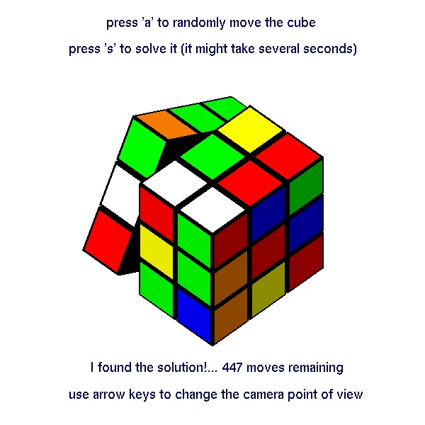
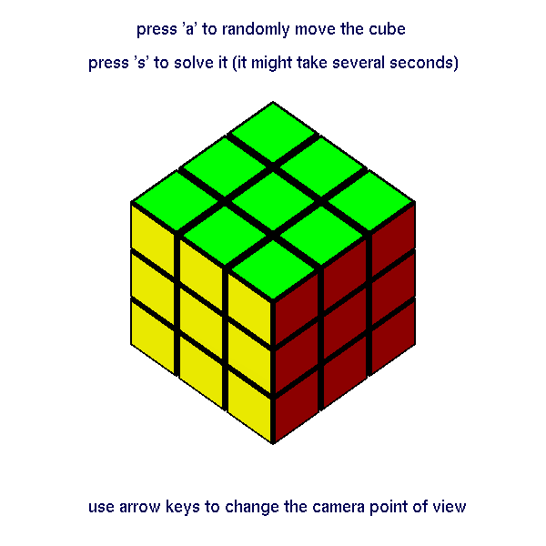

Rubik-solver
============

This code solves the Rubik's cube using group theory. It also comes with a 3D graphical implementation of the cube using PyOpenGL.   

Usage
-----

Just run mvts.py using python::

$ python mvts.py

When a window with a Rubik's cube pops up you may control it by using your keyboard. In particular you can:

* Change the camera point of view by using the arrow keys
* Randomly move the cube by pressing the `a` key
* Solve the cube by pressing the `s` key (it might take several seconds)
* Move the front face in the clockwise (respectively counterclockwise) direction when pressing the `F` (resp. `f`) key
* Move the back face in the clockwise (respectively counterclockwise) direction when pressing the `B` (resp. `b`) key
* Move the right face in the clockwise (respectively counterclockwise) direction when pressing the `R` (resp. `r`) key
* Move the left face in the clockwise (respectively counterclockwise) direction when pressing the `L` (resp. `l`) key
* Move the upper face in the clockwise (respectively counterclockwise) direction when pressing the `U` (resp. `u`) key
* Move the downer face in the clockwise (respectively counterclockwise) direction when pressing the `D` (resp. `d`) key
* quit and close the window by pressing the `q` or `esc` key

Dependencies
------------

This code depends on Python, NumPy, SciPy and PyOpenGL and has been tested on
Linux with the following versions:

* Python 2.7, NumPy 1.6, SciPy 0.14, PyOpenGL 3.0.1

but there is no reason it shouldn't work on Windows or Mac OS X. 

Bug reporting
-------------

If you find any bugs file them on the `issue tracker`_.

.. _`issue tracker`: https://github.com/Gillu13/Rubik-solver/issues

Install
-------

Except the dependencies, there is nothing to install.

Notes
-----

The mathematics behind the algorithm that we use in this code are greatly inspired by Janet Chen course notes "Group Theory and the Rubik's cube" [1]_ even though there are some differences in the way orientations of cubies are described.  

Screenshots
-----------

.. image:: capture_unsolved.png
   :align: center

References
----------

.. [1] Janet Chen, "Group Theory and the Rubik's cube", http://www.math.harvard.edu/~jjchen/docs/Group%20Theory%20and%20the%20Rubik%27s%20Cube.pdf
